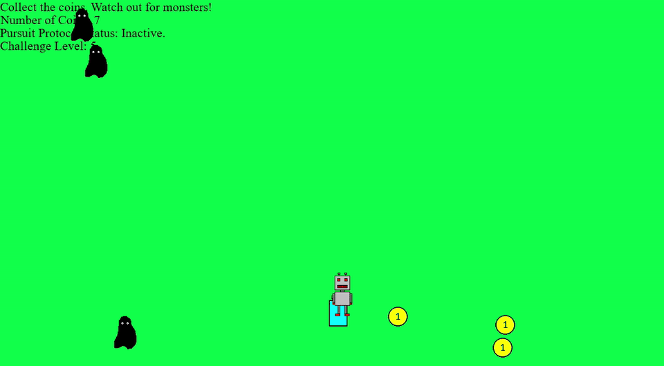

# Pursuit Protocol

A top-down chase game written in Python with pygame. Guide a robot around the field, collect every coin, and reach the door before the monsters catch you. Monsters patrol across the screen until you get too close, then switch into pursuit mode and hunt you down.



This was my final project for the [University of Helsinki Python Programming MOOC 2025](https://programming-25.mooc.fi/) (Advanced Course), which I completed for the advanced certificate.

## How to play

| | |
|---|---|
| **Goal** | Collect all coins to unlock the door, then reach the door |
| **Move** | Arrow keys |
| **Start / next round** | Enter |

The HUD shows your coin count, the current challenge level, and whether the "Pursuit Protocol" is active (a monster is chasing you).

## Running it

**Requirements:** Python 3.13 and pygame 2.6.1, the setup verified on Windows. pygame is the only dependency, and all sprite images are included in `src/assets/`. Any way of getting Python 3.13 works (python.org, uv, conda, etc.); none of those tools is required.

```bash
git clone https://github.com/urielbenymon/pursuit-protocol.git
cd pursuit-protocol
python -m venv .venv
```

Activate the virtual environment:

| Shell | Command |
|---|---|
| Windows (PowerShell) | `.venv\Scripts\Activate.ps1` |
| Windows (Git Bash) | `source .venv/Scripts/activate` |
| macOS / Linux | `source .venv/bin/activate` |

Then install and run:

```bash
pip install -r requirements.txt
python src/main.py
```

The game finds its images relative to `main.py`, so it can be launched from the repository root (as above) or from inside `src/` with `python main.py`.

### Python 3.14

pygame 2.6.1 (the latest `pygame` release) has no prebuilt package for Python 3.14, so on 3.14 `pip install pygame` tries to compile it from source, which fails on Windows. This is an installation problem, not a known incompatibility in the game's code. If `python` on your machine is 3.14, create the environment with 3.13 explicitly:

- Windows: `py -3.13 -m venv .venv` (with Python 3.13 installed from python.org)
- macOS / Linux: `python3.13 -m venv .venv`

[pygame-ce](https://pypi.org/project/pygame-ce/), the actively maintained community fork, does ship Python 3.14 packages and installs as `import pygame`, but this game hasn't been tested with it.

## How it works

**Adaptive difficulty.** The game has 8 challenge levels. Winning a round moves you up a level and losing moves you down one, so the game settles around your skill. Each level scales the round's parameters:

| Parameter | Level 1 | Per level | Level 8 |
|---|---|---|---|
| Coins | 2 | +2 | 16 |
| Monsters | 1 | +1 (capped at 3 until level 7) | 4 |
| Monster patrol speed (px/frame) | 0.45 | +0.09 | 1.08 |
| Monster detection radius (px) | 70 | +2 | 84 |

**Patrol and chase states.** Each monster is a small two-state machine. In *patrol* mode it crosses the screen horizontally and respawns at a random height off the opposite edge. Every frame, the game measures the Euclidean distance between the robot's center and each monster's center. Inside the detection radius the monster switches to *chase* mode and steers toward the robot on both axes. It only gives up once you're 50 px beyond the radius. That gap (hysteresis) stops monsters from flickering between states at the boundary.

**Collisions.** Coin pickups, the door, and monster contact all use axis-aligned bounding-box overlap between the sprite rectangles.

## Project structure

```
src/
├── main.py      # game loop, sprite classes, difficulty scaling, collision logic
└── assets/      # robot, monster, coin and door sprites
```

## Changes since submission

The earlier commits in this repository contain the game as submitted for the course. This update cleans it up:

- Monster and robot centers were computed as `(x + width) // 2` instead of `x + width / 2`, which effectively doubled the detection radius
- Coin and door collision only registered when approaching from certain sides; all collisions now use a proper rectangle-overlap test
- Monster-contact detection is now a standard overlap check
- Levels 4–6 now set the monster count explicitly instead of inheriting it from the previous round
- `resetDoor` used `==` instead of `=`, so it never reset anything
- Sprites now load from a path relative to `main.py`, so the game runs from any directory
- The tutorial screen is capped at 60 FPS instead of spinning the CPU

## Credits

- Game design and code: Uriel Benymon
- Sprite images (`src/assets/`) come from the University of Helsinki [Python Programming MOOC 2025](https://programming-25.mooc.fi/) course material, © University of Helsinki / MOOC.fi, used under [CC BY-NC-SA 4.0](https://creativecommons.org/licenses/by-nc-sa/4.0/)

## License

The source code is released under the MIT License (see [LICENSE](LICENSE)). The sprite images are not covered by the MIT License; they remain under CC BY-NC-SA 4.0 as noted above.
